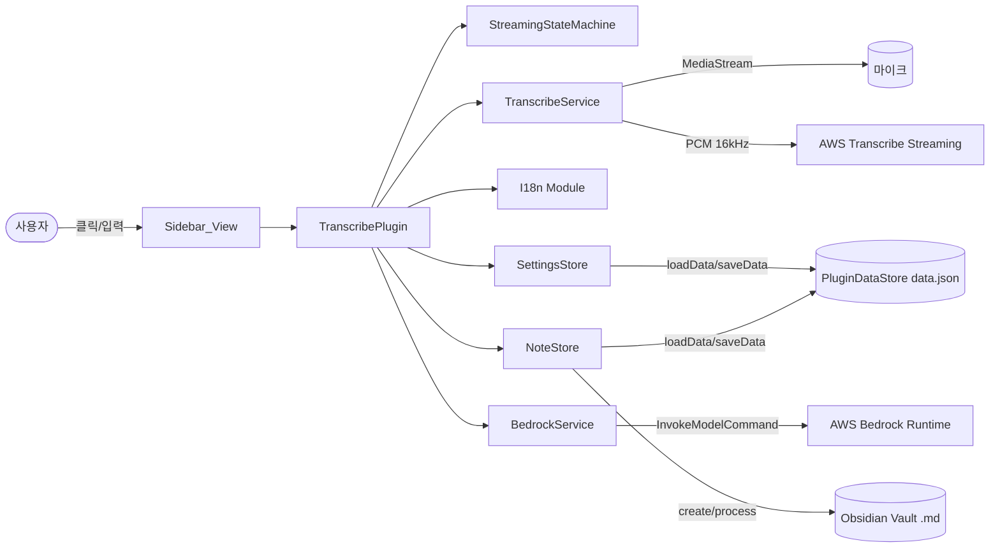
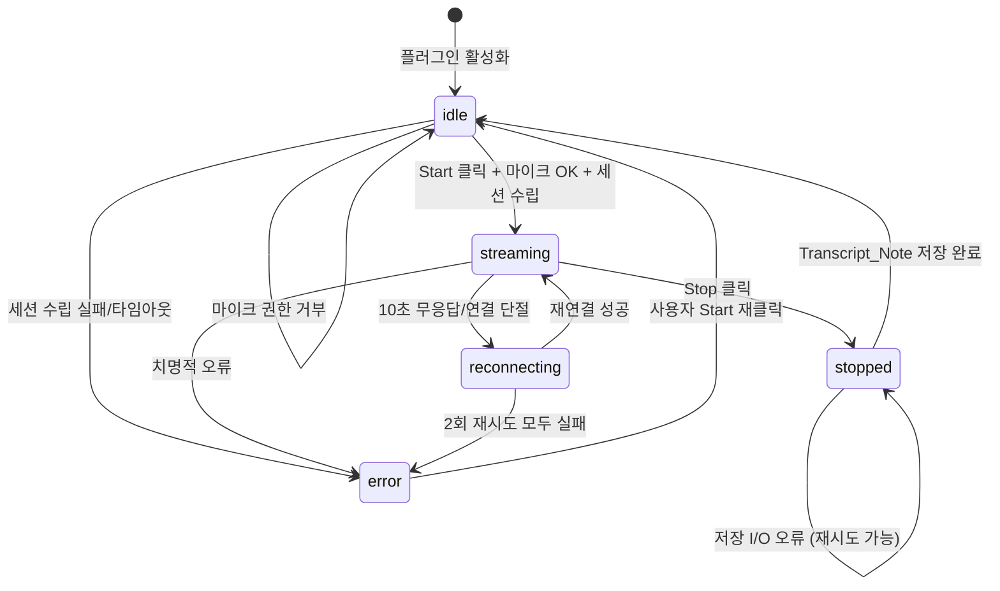

# Design Document

## Overview

본 설계 문서는 Obsidian 에디터에서 동작하는 실시간 음성-텍스트 전사 플러그인(`obsidian-transcribe-plugin`)의 기술적 구조를 정의한다. 이 플러그인은 Obsidian Plugin API 위에서 TypeScript로 구현되며, 커뮤니티 플러그인 심사 기준(Developer Policies, Submission Requirements, Plugin Guidelines 2026-03)을 준수한다. 다음 세 가지 주요 기능을 제공한다.

1. **실시간 전사**: `navigator.mediaDevices.getUserMedia`로 마이크 오디오를 캡처하고, AudioWorklet에서 PCM 16kHz/16-bit/mono로 변환한 뒤 AWS Transcribe Streaming으로 전송한다. Partial_Result와 Final_Result를 사이드바에 실시간 표시한다.
2. **노트 저장 및 편집**: 전사가 중지되면 누적된 텍스트를 `Transcribe-YYYYMMDD-HHmmss.md` 형식의 마크다운 파일로 저장하며, 사용자가 사이드바에서 직접 편집한다. Vault 수정은 `Vault.process()` API를 사용해 동시 편집 충돌을 방지한다.
3. **AI 분석**: AWS Bedrock Runtime을 통해 사용자가 선택한 파운데이션 모델로 전사 내용을 요약/분석한다.

### 설계 목표

- **단순성**: 사이드바의 3개 버튼(시작/중지, 편집, 분석)만으로 모든 기능을 사용한다.
- **자원 안전성**: 플러그인 비활성화/재시작 시 마이크와 네트워크 세션이 반드시 정리된다.
- **장애 복원성**: 일시적 네트워크 단절에 대해 재연결을 시도하고, 실패 시에도 진행 중이던 전사 내용은 손실 없이 저장한다.
- **심사 준수**: 금지 API 미사용, CSS 변수 기반 스타일, i18n, `registerEvent` 기반 리스너 관리, `Vault.process` 기반 파일 수정을 강제한다.
- **다국어**: 영어(기본)와 한국어 UI를 지원하고 설정 탭 첫 항목에 언어 선택을 배치한다.

### 주요 기술 스택

- **언어**: TypeScript (ES2020 target, `strict: true`)
- **플러그인 API**: `obsidian` 패키지 (`Plugin`, `ItemView`, `WorkspaceLeaf`, `PluginSettingTab`, `Setting`, `Notice`, `Vault`, `TFile`, `TFolder`, `AbstractInputSuggest`, `normalizePath`)
- **AWS SDK v3**:
  - `@aws-sdk/client-transcribe-streaming` — 실시간 스트리밍 전사
  - `@aws-sdk/client-bedrock-runtime` — Bedrock `InvokeModelCommand`
- **브라우저 API**: `navigator.mediaDevices.getUserMedia`, `AudioContext`, `AudioWorkletNode`, `AbortController`
- **빌드**: `esbuild` (Obsidian 공식 샘플 플러그인 템플릿 기준, `external: ["obsidian", "electron", ...builtins]`)
- **테스트**: `vitest` + `fast-check`(PBT) + `aws-sdk-client-mock`

### 플랫폼 및 배포 결정

- **`isDesktopOnly = true`**: MediaStream + AudioWorklet + AWS SDK 조합은 모바일 Obsidian에서의 동작이 보장되지 않으므로 데스크톱 전용으로 지정한다.
- **번들 전략**: AWS SDK는 필요 모듈만 import하고, `esbuild` tree shaking을 활성화해 번들 크기를 억제한다.
- **LICENSE**: MIT 권장, 저장소 루트에 배치(심사 필수).
- **README 공개 사항**: 외부 네트워크 사용(AWS Transcribe/Bedrock), AWS 계정 필요, 과금 책임, PluginDataStore에 자격 증명 평문 저장을 명시한다.

### 비범위(Out of Scope)

- 다국어 동시 전사(한 세션에서 단일 언어 코드 사용)
- 오프라인 전사(AWS 서비스 의존)
- 오디오 파일 업로드 전사(라이브 스트리밍 전용)
- 다중 스피커 식별(Transcribe diarization)
- 모바일(iOS/Android) 지원

## Architecture

### 아키텍처 다이어그램



### 레이어 구조

| 레이어 | 책임 | 주요 모듈 |
|---|---|---|
| 진입점 | 플러그인 수명 주기, 커맨드/리본/뷰 등록, i18n 로드 | `TranscribePlugin` |
| 프레젠테이션 | UI 렌더링, 사용자 입력, 상태 표시 | `SidebarView` |
| 상태 관리 | `Streaming_State` 전이, 버튼 활성화 정책 | `StreamingStateMachine`, `ButtonStatePolicy` |
| 도메인 서비스 | 전사/분석, 오디오 파이프라인 | `TranscribeService`, `BedrockService`, `AudioCapture` |
| 영속화 | 노트 생성/수정, 설정 저장 | `NoteStore`, `SettingsStore` |
| 설정 UI | 설정 탭 렌더링, 입력 검증, 폴더 자동완성 | `TranscribeSettingTab`, `FolderSuggest` |
| 국제화 | 번역 로드, 로케일 감지, 런타임 전환 | `i18n/index.ts`, `i18n/en.ts`, `i18n/ko.ts` |

### 상태 머신 (Streaming_State)



**주의**: `reconnecting`은 관찰용 하위 플래그이며 외부 `Streaming_State` 값은 `streaming`으로 유지된다. `SidebarView`가 하위 플래그를 감지해 "재연결 시도 중" 메시지를 표시한다.

### 동시성 모델

- **싱글 스트리밍 세션 불변식**: 동시에 존재하는 Transcribe 세션은 최대 1개(Requirement 7.5). `TranscribeService.activeSession: AbortController | null` 필드로 강제.
- **분석 요청 단일화**: `BedrockService`는 동시 1개의 `InvokeModelCommand`만 허용(Requirement 7.2).
- **UI 업데이트**: Obsidian 플러그인은 단일 이벤트 루프에서 동작하므로 `setState` 호출 즉시 렌더링에 반영된다.

## Components and Interfaces

### 1. TranscribePlugin (진입점)

`Plugin` 수명 주기를 관리하고 모든 하위 컴포넌트를 조립한다.

```ts
// src/main.ts
export default class TranscribePlugin extends Plugin {
    settings!: TranscribeSettings;
    settingsStore!: SettingsStore;
    t!: Translations;                   // 현재 로케일 번역
    state!: StreamingStateMachine;
    transcribeService!: TranscribeService;
    bedrockService!: BedrockService;
    noteStore!: NoteStore;

    async onload(): Promise<void>;
    async onunload(): Promise<void>;    // 자원 정리 (Requirement 8.2, 8.3, 8.4)
    async activateView(): Promise<void>; // "Open transcribe view" 커맨드 핸들러
    async changeLocale(locale: SupportedLocale): Promise<void>;  // Requirement 10.5
}
```

**주요 책임**:
- `registerView(VIEW_TYPE_TRANSCRIBE, (leaf) => new SidebarView(leaf, this))` — 콜백에서 참조 저장 금지 (Requirement 1.5)
- `addRibbonIcon("mic", t.commands.openView, ...)` 추가 (Requirement 1.2, 10.4)
- `addCommand({ id: "open-transcribe-view", name: t.commands.openView, callback: ... })` — hotkey 미지정 (Requirement 1.4)
- `addSettingTab(new TranscribeSettingTab(app, this))` (Requirement 2.1)
- `onunload`에서 `detachLeavesOfType` 호출 금지 (Requirement 1.6), 대신 `transcribeService.dispose()`로 세션/마이크 정리 (Requirement 8.2, 8.3)

### 2. SidebarView (프레젠테이션)

Obsidian `ItemView`를 상속한 사이드바 뷰. 모든 DOM은 `createEl`/`createDiv` API로 생성하고 `innerHTML` 계열을 사용하지 않는다(Requirement 9.5).

```ts
// src/views/SidebarView.ts
export const VIEW_TYPE_TRANSCRIBE = "transcribe-view";

export class SidebarView extends ItemView {
    constructor(leaf: WorkspaceLeaf, private plugin: TranscribePlugin);

    getViewType(): string;       // VIEW_TYPE_TRANSCRIBE
    getDisplayText(): string;    // plugin.t.view.displayText
    getIcon(): string;           // "mic"

    async onOpen(): Promise<void>;
    async onClose(): Promise<void>;

    render(): void;                                    // 전체 재렌더 (createEl 기반)
    onLocaleChange(t: Translations): void;             // Requirement 10.5
    updateState(state: StreamingState, reconnecting: boolean): void;  // Requirement 1.9
    appendPartial(text: string): void;                 // Requirement 3.5
    commitFinal(finalText: string): void;              // Requirement 3.6, 3.7
    loadNoteContent(content: string): void;            // Requirement 4.7
    enterEditMode(): void;                             // Requirement 5.3
    exitEditMode(save: boolean): Promise<void>;
    showAnalyzeSpinner(visible: boolean): void;        // Requirement 6.6
    refreshButtons(): void;                            // Requirement 7.3
}
```

**DOM 구조(모두 `createEl` 기반)**:

```
transcribe-sidebar (div)
├── transcribe-status (div, data-state="idle|streaming|stopped|error")
│   ├── state-label (span): t.states[state]
│   └── reconnect-label (span, 숨김 가능): t.states.reconnecting
├── transcribe-controls (div)
│   ├── start-stop-btn (button): t.buttons.start / t.buttons.stop
│   ├── edit-btn (button, disabled)
│   └── analyze-btn (button, disabled)
├── transcribe-spinner (div, 숨김 가능): t.ui.analyzing
└── transcribe-content (div)
    ├── [읽기 모드] transcript-text (div)
    └── [편집 모드] editor-textarea (textarea) + save-btn + cancel-btn
```

**상태 레이블 매핑**: `t.states.idle`, `t.states.streaming`, `t.states.stopped`, `t.states.error`, `t.states.reconnecting`.

### 3. StreamingStateMachine (상태 관리)

순수 로직 기반 FSM. 유효하지 않은 전이는 `IllegalTransitionError`로 거부한다.

```ts
// src/state/StreamingStateMachine.ts
export type StreamingState = "idle" | "streaming" | "stopped" | "error";

export type StreamingEvent =
    | { type: "START_REQUESTED" }
    | { type: "SESSION_ESTABLISHED" }
    | { type: "SESSION_FAILED"; reason: string }
    | { type: "STOP_REQUESTED" }
    | { type: "SESSION_CLOSED" }
    | { type: "CONNECTION_LOST" }
    | { type: "RECONNECT_SUCCEEDED" }
    | { type: "RECONNECT_EXHAUSTED" }
    | { type: "RESET" };

export class StreamingStateMachine {
    constructor(initial?: StreamingState);
    getState(): StreamingState;
    isReconnecting(): boolean;
    dispatch(event: StreamingEvent): StreamingState;
    onChange(listener: (next: StreamingState, reconnecting: boolean) => void): () => void;
}
```

**전이 테이블**:

| 현재 상태 | 이벤트 | 다음 상태 |
|---|---|---|
| `idle` | `START_REQUESTED` + `SESSION_ESTABLISHED` | `streaming` |
| `idle` | `SESSION_FAILED` | `error` |
| `streaming` | `STOP_REQUESTED` | `stopped` |
| `streaming` | `CONNECTION_LOST` | `streaming` (reconnecting=true) |
| reconnecting | `RECONNECT_SUCCEEDED` | `streaming` |
| reconnecting | `RECONNECT_EXHAUSTED` | `error` |
| `stopped` | `SESSION_CLOSED` | `idle` |
| `error` | `RESET` | `idle` |

### 4. ButtonStatePolicy (버튼 상태 결정)

순수 함수로 버튼 활성화 여부를 결정한다. UI와 정책을 분리해 테스트 가능성을 확보한다.

```ts
// src/state/ButtonStatePolicy.ts
export interface ButtonStateInputs {
    streamingState: StreamingState;
    isAnalyzing: boolean;
    isEditing: boolean;
    hasTranscriptNote: boolean;
    transcriptLength: number;
    hasCredentials: boolean;
    hasBedrockModel: boolean;
}

export interface ButtonStates {
    startStop: { enabled: boolean; labelKey: "start" | "stop" };
    edit: { enabled: boolean };
    analyze: { enabled: boolean };
}

export function computeButtonStates(inputs: ButtonStateInputs): ButtonStates;
```

**결정 규칙**:
- `startStop.enabled`: `!isAnalyzing && !isEditing`
- `startStop.labelKey`: `streamingState === "streaming" ? "stop" : "start"` (실제 레이블은 SidebarView에서 `t.buttons[labelKey]`로 해석)
- `edit.enabled`: `hasTranscriptNote && transcriptLength >= 1 && streamingState !== "streaming" && !isAnalyzing && !isEditing`
- `analyze.enabled`: `edit.enabled`의 모든 조건에 더해 `hasCredentials && hasBedrockModel`

### 5. TranscribeService (실시간 전사)

```ts
// src/services/TranscribeService.ts
export interface TranscribeCallbacks {
    onPartial(text: string): void;
    onFinal(text: string): void;
    onSessionEstablished(): void;
    onSessionError(reason: string): void;
    onReconnectAttempt(attempt: number): void;
    onConnectionLost(): void;
}

export class TranscribeService {
    constructor(
        private audioCapture: AudioCapture,
        private clientFactory: (creds: AwsCredentials, region: string) => TranscribeStreamingClient
    );

    async start(params: {
        credentials: AwsCredentials;
        region: string;
        languageCode: "ko-KR" | "en-US";
        callbacks: TranscribeCallbacks;
    }): Promise<void>;

    async stop(timeoutMs?: number): Promise<void>;   // 기본 5000
    dispose(): void;
    getTranscriptBuffer(): TranscriptBuffer;
    clearBuffer(): void;
}
```

**내부 동작**:
- `start()`: `StartStreamTranscriptionCommand`에 `MediaEncoding: "pcm"`, `SampleRateHertz: 16000`, `LanguageCode`, async generator로 변환된 `AudioStream` 전달.
- 10초 내 첫 이벤트가 없으면 `onSessionError("timeout")` 호출 (Requirement 3.10).
- `for await`로 `TranscriptEvent`의 `IsPartial` 필드로 분기.
- `CONNECTION_LOST` 감지 시 `reconnectWithBackoff(attempts=2, intervalMs=2000)` 실행 (Requirement 8.5).
- `stop()`: async generator에 end 신호 → 5초 경과 시 `AbortController.abort()` (Requirement 4.10).
- `dispose()`: 활성 세션과 마이크 트랙을 모두 해제.

**저수준 프로토콜 매핑** (참고 — 모두 SDK가 자동 처리):

| 요청 요소 | 값 / 근원 |
|---|---|
| HTTP 메서드/경로 | `POST /stream-transcription` (HTTP/2 단일 스트림, 양방향) |
| `Host` | `transcribestreaming.<region>.amazonaws.com` — 설정의 `region`에서 생성 |
| `authorization` | AWS SigV4 서명. `credentials`의 `accessKeyId`/`secretAccessKey`로 매 프레임 서명 체인 |
| `content-type` | `application/vnd.amazon.eventstream` |
| `x-amz-target` | `com.amazonaws.transcribe.Transcribe.StartStreamTranscription` |
| `x-amz-content-sha256` | `STREAMING-AWS4-HMAC-SHA256-EVENTS` (eventstream 시그니처) |
| `x-amz-date` | SDK가 UTC 기준으로 자동 생성 |
| `x-amz-transcribe-language-code` | 설정의 `LanguageCode`(`ko-KR` 또는 `en-US`) |
| `x-amz-transcribe-sample-rate` | `16000`(AudioCapture가 보장) |
| `transfer-encoding` | `chunked` — 각 PCM 청크가 별도 eventstream 프레임으로 전송 |

PCM 오디오 청크는 SDK가 `AudioEvent` 타입의 eventstream 프레임으로 감싸 전송하며, 응답은 `TranscriptEvent`/`BadRequestException` 등의 eventstream 프레임으로 수신한다.

**전송 계층 선택 (Obsidian/Electron 환경)**:
- Obsidian은 Electron 기반이고 Plugin은 `isDesktopOnly: true`이므로 Node.js `http2` 모듈 접근이 가능하다.
- `@aws-sdk/client-transcribe-streaming`은 기본 제공되는 Node.js 핸들러(`@aws-sdk/node-http-handler`)를 사용해 **HTTP/2 양방향 스트리밍**으로 동작한다.
- 순수 브라우저 환경에서만 필요한 WebSocket 미들웨어(`@aws-sdk/middleware-websocket`)는 사용하지 않는다.
- `esbuild.config.mjs`의 `external` 목록에 `builtin-modules`를 포함시켜 `http2`, `tls`, `crypto`, `stream` 등 Node 내장 모듈이 번들되지 않고 런타임에서 해결되도록 한다.
- CORS 프리플라이트는 적용되지 않는다(렌더러가 Node.js 네트워크 스택을 사용).

### 6. AudioCapture (오디오 파이프라인)

```ts
// src/services/AudioCapture.ts
export class AudioCapture {
    async requestPermission(): Promise<MediaStream>;           // Requirement 3.1
    async *pcmChunks(stream: MediaStream, chunkMs?: number): AsyncIterable<Uint8Array>;  // Requirement 3.4
    stop(stream: MediaStream): void;                            // Requirement 8.3
}
```

**PCM 변환 파이프라인**:
1. `navigator.mediaDevices.getUserMedia({ audio: { sampleRate: 16000, channelCount: 1, echoCancellation: true } })`
2. `AudioContext`로 `MediaStreamSource` → `AudioWorkletNode` 연결
3. AudioWorklet에서 Float32 샘플 수집, `chunkMs * 16` 샘플마다 Int16 PCM으로 변환 후 postMessage
4. 메인 스레드에서 `Uint8Array`로 래핑해 yield
5. 브라우저가 48kHz를 반환하는 경우 AudioWorklet 내에서 3:1 다운샘플링

**자원 해제**: `stop(stream)`은 `stream.getTracks().forEach(t => t.stop())`과 `AudioContext.close()`를 호출한다.

### 7. BedrockService (AI 분석)

```ts
// src/services/BedrockService.ts
export class BedrockService {
    constructor(
        private clientFactory: (creds: AwsCredentials, region: string) => BedrockRuntimeClient
    );

    async analyze(params: {
        credentials: AwsCredentials;
        region: string;
        modelId: string;
        transcript: string;
        timeoutMs?: number;                     // 기본 30000
        locale: SupportedLocale;                // 프롬프트 언어 결정
    }): Promise<string>;
}
```

**내부 동작**:
- 요청 본문(Claude 3 계열): `{ anthropic_version: "bedrock-2023-05-31", max_tokens: 4000, messages: [{ role: "user", content: buildPrompt(locale, transcript) }] }`.
- `AbortController`로 30초 타임아웃 강제 (Requirement 6.11).
- 에러 분기:
  - `AccessDeniedException`, `UnrecognizedClientException` → 인증/권한 오류 (Requirement 6.13)
  - `ValidationException`(모델 리전 미지원) → 모델 불가 알림 (Requirement 6.14)
  - 그 외 → 네트워크 오류 (Requirement 6.15)

**분석 프롬프트(locale별)**:
- 영어: `"The following is a meeting/lecture transcript. Summarize in concise markdown: (1) key summary (3-5 sentences), (2) main keywords (5-10), (3) action items (if any)."` + `"--- transcript start ---\n" + transcript + "\n--- transcript end ---"`
- 한국어: `"다음은 회의/강의 전사 내용입니다. 간결한 마크다운으로 정리해 주세요: (1) 핵심 요약(3~5문장), (2) 주요 키워드(5~10개), (3) 실행 항목(있다면)."` + 동일한 transcript 구분선

### 8. NoteStore (파일 I/O)

```ts
// src/services/NoteStore.ts
export interface TranscriptNoteMeta {
    startedAt: string;                          // ISO 8601
    endedAt: string;
    language: "ko-KR" | "en-US";
}

export class NoteStore {
    constructor(private vault: Vault);

    async saveTranscript(
        body: string,
        meta: TranscriptNoteMeta,
        folder: string,                         // Transcript_Folder (normalizePath 적용)
        now?: Date
    ): Promise<TFile>;

    async overwriteTranscript(file: TFile, newBody: string): Promise<void>;    // Vault.process
    async appendAnalysis(file: TFile, analysis: string, locale: SupportedLocale): Promise<void>;
    async readTranscriptBody(file: TFile): Promise<string>;                     // 프론트매터 제외

    resolveUniqueFilename(base: string, existing: Set<string>): string;         // 순수 함수
    ensureFolder(folder: string): Promise<string>;                              // 폴더 생성 or 루트 fallback
}
```

**파일명 충돌 회피 (Requirement 4.4)**:

```ts
resolveUniqueFilename(base: string, existing: Set<string>): string {
    if (!existing.has(`${base}.md`)) return `${base}.md`;
    let n = 1;
    while (existing.has(`${base}-${n}.md`)) n++;
    return `${base}-${n}.md`;
}
```

**파일 수정은 `Vault.process(file, (content) => ...)`만 사용** (Requirement 9.9).

**프론트매터 포맷(Requirement 4.6)**:

```
---
startedAt: 2025-01-15T09:30:00+09:00
endedAt: 2025-01-15T09:42:15+09:00
language: ko-KR
---
```

### 9. SettingsStore & TranscribeSettingTab & FolderSuggest

```ts
// src/settings/SettingsStore.ts
export class SettingsStore {
    constructor(private plugin: Plugin);
    async load(): Promise<TranscribeSettings>;
    async save(settings: TranscribeSettings): Promise<void>;
    validate(settings: TranscribeSettings): ValidationResult;       // 순수
}

// src/settings/TranscribeSettingTab.ts
export class TranscribeSettingTab extends PluginSettingTab {
    display(): void;                   // 첫 항목: UI_Locale 드롭다운 (Requirement 2.2)
    hide(): void;
}

// src/settings/FolderSuggest.ts
export class FolderSuggest extends AbstractInputSuggest<TFolder> {
    getSuggestions(query: string): TFolder[];
    renderSuggestion(folder: TFolder, el: HTMLElement): void;
    selectSuggestion(folder: TFolder): void;
}
```

**검증 규칙(순수 함수 `validate`)**:

| 필드 | 규칙 |
|---|---|
| `accessKeyId` | 길이 0~128 (Requirement 2.5, 2.16) |
| `secretAccessKey` | 길이 0~256 (Requirement 2.6, 2.16) |
| `region` | 비어 있지 않음 |
| `bedrockModelId` | 길이 0~256 (Requirement 2.8) |
| `languageCode` | `"ko-KR"` 또는 `"en-US"` |
| `uiLocale` | `"en"` 또는 `"ko"` |
| `transcriptFolder` | `normalizePath` 적용 가능한 문자열 |

**설정 탭 렌더링 순서**(Requirement 2.2, 2.4):
1. `UI_Locale` 드롭다운(첫 항목)
2. `setHeading("AWS credentials")` → access key id, secret key(password 타입), region
3. `setHeading("Transcription")` → language code, transcript folder(`FolderSuggest` 연결)
4. `setHeading("Analysis")` → bedrock model id
5. `setHeading("About")` → 자격 증명 저장 위치 보안 고지 텍스트 (Requirement 2.13)

### 10. I18n 모듈

```ts
// src/i18n/en.ts  (기본, 누락 키 없음)
export const en = {
    view: { displayText: "Transcribe" },
    commands: { openView: "Open transcribe view" },
    buttons: { start: "Start streaming", stop: "Stop streaming", edit: "Edit", analyze: "Analyze", save: "Save", cancel: "Cancel" },
    states: { idle: "Idle", streaming: "Streaming", stopped: "Stopped", error: "Error", reconnecting: "Reconnecting..." },
    ui: { empty: "No transcript available.", analyzing: "Analyzing..." },
    settings: {
        language: { name: "Display language", desc: "Select the display language." },
        awsHeading: "AWS credentials",
        accessKeyId: { name: "AWS access key ID", desc: "Your AWS IAM access key id." },
        // ... (생략: 전체 키는 구현 시 확정)
    },
    notices: {
        micPermissionDenied: "Microphone permission is required.",
        missingSettings: (fields: string[]) => `Missing settings: ${fields.join(", ")}`,
        // ...
    },
} as const;
export type Translations = typeof en;

// src/i18n/ko.ts
import type { Translations } from "./en";
export const ko: Translations = { /* 전체 키 한국어 매핑 */ };

// src/i18n/index.ts
export type SupportedLocale = "en" | "ko";
const LOCALES: Record<SupportedLocale, Translations> = { en, ko };

export function detectLocale(setting?: string): SupportedLocale {
    if (setting && setting in LOCALES) return setting as SupportedLocale;
    const sys = navigator.language.split("-")[0];
    return sys in LOCALES ? (sys as SupportedLocale) : "en";
}

export function createI18n(locale: SupportedLocale): Translations {
    return LOCALES[locale] ?? en;
}
```

**런타임 전환(Requirement 10.5)**:
```ts
async changeLocale(locale: SupportedLocale) {
    this.settings.uiLocale = locale;
    this.t = createI18n(locale);
    await this.settingsStore.save(this.settings);
    this.app.workspace.getLeavesOfType(VIEW_TYPE_TRANSCRIBE).forEach((leaf) => {
        if (leaf.view instanceof SidebarView) leaf.view.onLocaleChange(this.t);
    });
}
```

### 11. manifest.json

```json
{
    "id": "obsidian-transcribe-plugin",
    "name": "Transcribe",
    "version": "0.1.0",
    "minAppVersion": "1.4.0",
    "description": "Transcribe microphone audio in real time via AWS Transcribe and analyze results with AWS Bedrock.",
    "author": "yourname",
    "authorUrl": "https://github.com/yourname",
    "isDesktopOnly": true
}
```

`description`은 250자 이하, 행동 문장, 마침표 종료, 이모지 없음 (Requirement 9.1).

## Data Models

### AwsCredentials

```ts
export interface AwsCredentials {
    accessKeyId: string;        // 길이 0~128
    secretAccessKey: string;    // 길이 0~256
}
```

### TranscribeSettings

```ts
export interface TranscribeSettings {
    uiLocale: SupportedLocale;                    // 기본 detectLocale()
    accessKeyId: string;                          // 기본 ""
    secretAccessKey: string;                      // 기본 ""
    region: string;                               // 기본 "us-east-1"
    bedrockModelId: string;                       // 기본 ""
    languageCode: "ko-KR" | "en-US";              // 기본 "ko-KR"
    transcriptFolder: string;                     // 기본 "" (vault 루트)
}

export const DEFAULT_SETTINGS: TranscribeSettings = {
    uiLocale: "en",
    accessKeyId: "",
    secretAccessKey: "",
    region: "us-east-1",
    bedrockModelId: "",
    languageCode: "ko-KR",
    transcriptFolder: "",
};
```

**영속화 위치**: Obsidian이 관리하는 `.obsidian/plugins/obsidian-transcribe-plugin/data.json`. `Plugin.loadData()` / `Plugin.saveData()`로만 접근 (Requirement 2.12).

### TranscriptBuffer

```ts
export class TranscriptBuffer {
    private chunks: string[] = [];
    private pendingPartial: string = "";

    appendFinal(text: string): void;
    setPartial(text: string): void;
    getSnapshot(): { committed: string; partial: string };
    getCommittedText(): string;       // chunks.join(" ")
    length(): number;
    clear(): void;
    isEmpty(): boolean;               // trim 후 길이 0
}
```

**불변식**:
- `pendingPartial`은 아직 `chunks`에 반영되지 않은 임시 텍스트
- `appendFinal` 호출 시 `pendingPartial`이 비워지고 `chunks`에 추가됨
- `length() === getCommittedText().length`

### Transcript_Note 파일 구조

```
---
startedAt: <ISO8601>
endedAt: <ISO8601>
language: <"ko-KR" | "en-US">
---

<본문: Final_Result 누적 텍스트>

## Analysis result  (또는 "## 분석 결과")

<Bedrock 분석 결과 1>

## Analysis result

<Bedrock 분석 결과 2>
```

**본문 갱신 규칙**:
- 편집 저장: `Vault.process(file, (content) => 프론트매터 + "\n\n" + newBody)` — 프론트매터 보존(Requirement 5.5, 6.9)
- 분석 결과 추가: `Vault.process(file, (content) => content + "\n\n" + header + "\n\n" + analysis)` (Requirement 6.8~6.10)

### 파일명 생성 규칙

- 기본: `<Transcript_Folder>/Transcribe-YYYYMMDD-HHmmss.md`(로컬 타임존, `normalizePath` 적용)
- 충돌: `-N` 접미사(N=1부터 증가)
- 폴더 부재: `Vault.createFolder` 시도, 실패 시 vault 루트로 fallback (Requirement 4.5)

## CSS 및 스타일 전략

모든 스타일은 `styles.css`의 CSS 클래스로 정의하고 Obsidian CSS 변수를 사용한다(Requirement 9.7).

```css
.transcribe-sidebar { padding: var(--size-4-3); color: var(--text-normal); }
.transcribe-status { background: var(--background-secondary); border-radius: var(--radius-m); padding: var(--size-4-2); }
.transcribe-status[data-state="error"] { border-left: 3px solid var(--background-modifier-error); }
.transcribe-controls { display: flex; gap: var(--size-4-2); margin-top: var(--size-4-3); }
.start-stop-btn { background: var(--interactive-accent); color: var(--text-on-accent); }
.transcript-text { font-family: var(--font-monospace); white-space: pre-wrap; }
.transcript-text .partial { color: var(--text-muted); font-style: italic; }
.transcribe-spinner { color: var(--text-muted); }
```

## Correctness Properties

본 플러그인은 상태 머신, 버퍼, 파일명 충돌 회피, 설정 검증, 분석 결과 부착 등 **순수 함수/결정적 로직**을 다수 포함하므로 PBT가 적합하다. 마이크 캡처, AWS 네트워크 호출, UI 타이밍, i18n 렌더링 등 I/O 의존 수용 기준은 예시/통합 테스트로 처리한다.

### Property 1: 상태 머신 전이 규칙

*임의의* `StreamingState` 초기값과 `StreamingEvent` 시퀀스에 대해:
- `idle`에서 `START_REQUESTED` → `SESSION_ESTABLISHED` 쌍 순서 발생 시 결과 상태는 `streaming`.
- `idle`에서 `SESSION_FAILED` → 결과 `error`.
- `streaming`에서 `STOP_REQUESTED` → 결과 `stopped`.
- `streaming`에서 `START_REQUESTED` → 결과 `streaming` 유지(단일 세션 불변식).
- `streaming`에서 `CONNECTION_LOST` → `isReconnecting() === true`, 외부 상태값 `streaming` 유지.
- reconnecting에서 `RECONNECT_EXHAUSTED` → 결과 `error`.
- 정의되지 않은 이벤트-상태 조합에서는 상태 불변 또는 `IllegalTransitionError`, 부작용 없음.

**Validates: Requirements 3.3, 3.10, 3.11, 4.1, 7.5, 7.6, 8.7**

### Property 2: 버튼 상태 결정 규칙

*임의의* `ButtonStateInputs`에 대해:
- `startStop.labelKey === "stop" ⇔ streamingState === "streaming"`.
- `startStop.enabled ⇔ !isAnalyzing && !isEditing`.
- `edit.enabled ⇔ hasTranscriptNote && transcriptLength >= 1 && streamingState !== "streaming" && !isAnalyzing && !isEditing`.
- `analyze.enabled ⇔ edit.enabled 조건 + hasCredentials && hasBedrockModel`.
- `isAnalyzing === true`이면 세 버튼 모두 `enabled === false`.

**Validates: Requirements 3.8, 5.1, 5.2, 6.1, 6.2, 6.3, 6.7, 7.1, 7.2, 7.3, 8.8**

### Property 3: TranscriptBuffer 누적 및 치환 규칙

*임의의* 문자열 시퀀스 `partials`와 `finals`에 대해 각 partial을 `setPartial`, 각 final을 `appendFinal`로 적용:
- `getCommittedText()`는 `finals`의 모든 원소를 입력 순서대로 포함한다.
- 마지막 `appendFinal` 이후 `getSnapshot().partial === ""`.
- `length() === getCommittedText().length`.
- `partials`의 중간값들은 `chunks`에 누적되지 않는다.

**Validates: Requirements 3.6, 3.7**

### Property 4: TranscriptBuffer 공백 전용 검출

*임의의* 유니코드 공백 문자(스페이스, 탭, 개행, 전각 공백 등)만으로 구성된 `s`에 대해 `appendFinal(s)` 후 `isEmpty() === true`. 공백이 아닌 문자가 하나라도 포함되면 `isEmpty() === false`.

**Validates: Requirements 4.9, 5.8**

### Property 5: 설정 길이 검증 규칙

*임의의* `TranscribeSettings`에 대해 `validate(settings)`의 `errors`가 비어 있을 필요충분조건:
- `accessKeyId.length <= 128`
- `secretAccessKey.length <= 256`
- `bedrockModelId.length <= 256`
- `languageCode ∈ {"ko-KR", "en-US"}`
- `uiLocale ∈ {"en", "ko"}`
- `region`이 비어 있지 않음

위 중 하나라도 위반 시 `errors`는 해당 필드명을 포함한다.

**Validates: Requirements 2.5, 2.6, 2.8, 2.16, 10.3**

### Property 6: 파일명 충돌 회피 규칙

*임의의* `base: string`과 `existing: Set<string>`에 대해 `resolveUniqueFilename(base, existing)`의 결과 `name`:
- `!existing.has(name)`
- `name === base + ".md"` 또는 `name === base + "-" + N + ".md"` (N은 양의 정수)
- `base + ".md"`가 `existing`에 없으면 `name === base + ".md"`.
- `base + ".md"` 및 `base + "-1.md" ... base + "-" + (N-1) + ".md"`가 모두 `existing`에 존재하고 `base + "-" + N + ".md"`가 존재하지 않으면 `name === base + "-" + N + ".md"`.

**Validates: Requirement 4.4**

### Property 7: 프론트매터 직렬화 보존

*임의의* `TranscriptNoteMeta`와 본문 `body`에 대해 `saveTranscript`가 생성한 파일을 `readTranscriptBody`와 프론트매터 파서로 재구성하면:
- 프론트매터는 `meta`의 모든 필드를 값 변경 없이 포함.
- 본문은 입력 `body`와 동일.
- `language` 필드는 `"ko-KR"` 또는 `"en-US"` 외 값으로 저장되지 않는다.

**Validates: Requirement 4.6**

### Property 8: 편집 덮어쓰기 본문 보존 규칙

*임의의* 기존 `TranscriptNoteMeta`를 가진 파일과 새 본문 `newBody`(공백 아닌 문자 1자 이상 포함)에 대해 `overwriteTranscript(file, newBody)` 후:
- 파싱된 본문은 `newBody`와 동일.
- 프론트매터 필드(`startedAt`, `endedAt`, `language`)는 덮어쓰기 이전 값과 동일.

**Validates: Requirements 5.5, 9.9**

### Property 9: 분석 결과 부착 규칙

*임의의* 기존 본문 `body`, 분석 결과 `analysis`, `locale`에 대해 `appendAnalysis`의 결과 `result`:
- `result.startsWith(body) === true`.
- `result`에는 `locale`에 해당하는 헤더(`## Analysis result` 또는 `## 분석 결과`)와 `analysis`가 끝부분에 등장한다.
- 기존 `body`에 이미 분석 결과 섹션이 포함되어 있더라도 `result`에는 **추가로** 새 섹션이 나타난다(기존 섹션 개수 + 1).

**Validates: Requirements 6.8, 6.9, 6.10**

### Property 10: 본문 길이 경계 검증 규칙

*임의의* 문자열 `transcript`에 대해 `BedrockService.analyze` 호출:
- `transcript.length <= 100000` → SDK `send` 호출.
- `transcript.length > 100000` → `send` 호출되지 않고 길이 초과 알림 발생.

**Validates: Requirement 6.5**

### Property 11: 자격 증명/모델 누락 보호 불변식

*임의의* `TranscribeSettings`에서 `accessKeyId`, `secretAccessKey`, `bedrockModelId` 중 하나라도 빈 문자열이면 버튼 핸들러 실행 후:
- `TranscribeService.start` 또는 `BedrockService.analyze`의 `send`가 호출되지 않는다.
- `Streaming_State`가 변경되지 않는다.
- `Transcript_Note` 파일이 생성/수정되지 않는다.
- 누락 필드를 포함한 `Notice`가 발생한다.

**Validates: Requirement 2.14**

### Property 12: 단일 Transcribe 세션 불변식

*임의의* `TranscribeService` 인스턴스에 대해 `start`/`stop` 호출의 임의의 인터리빙 시퀀스에서, 임의 시점의 `activeSession !== null` 카운트는 항상 0 또는 1이다.

**Validates: Requirement 7.5**

### Property 13: 재연결 시도 횟수 상한

*임의의* `CONNECTION_LOST` 발생 시나리오에서 수행된 재연결 시도 횟수 `attempts`는 `attempts <= 2`. `attempts === 2` 후 모두 실패 시 상태는 `error`.

**Validates: Requirement 8.5, 8.7**

### Property 14: Streaming 중 Edit/Analyze 상태 보존

*임의의* `Streaming_State === "streaming"` 상황에서 `Edit_Button` 또는 `Analyze_Button` 핸들러 호출 전후:
- `Streaming_State` 불변.
- `Transcript_Note` 파일 불변.
- `TranscriptBuffer.getCommittedText()` 불변.

**Validates: Requirement 7.4**

### Property 15: 경로 정규화 안전성

*임의의* 사용자 입력 `Transcript_Folder` 문자열에 대해 `NoteStore.saveTranscript`가 Vault API에 전달하는 경로는 항상 `normalizePath(input)`의 결과이며, 경로 탐색(`..`) 또는 절대 경로가 포함되지 않는다.

**Validates: Requirement 9.8**

## Error Handling

### 오류 분류 및 대응 전략

| 분류 | 예시 | 대응 | 사용자 피드백 |
|---|---|---|---|
| 설정 오류 | 자격 증명 누락, 모델 미선택 | 동작 개시 전 차단 | `Notice`에 누락 필드명 (Requirement 2.14) |
| 권한 오류 | 마이크 거부, AccessDenied | `idle`/`error`로 복귀 | `Notice`에 권한 재안내 |
| 네트워크 일시 단절 | Transcribe 연결 중단 | 2회 재연결(2초 간격) | 상태 영역에 "재연결 시도 중" |
| 네트워크 영구 실패 | 재연결 2회 실패 | `error` + 버퍼 자동 저장 | `Notice` 5초+ |
| AWS 서비스 오류 | `ValidationException`(모델 불가) | 분석 중단, 본문 불변 | `Notice` 5초+ (Requirement 6.13~6.15) |
| 타임아웃 | 세션 10초, 분석 30초 | `AbortController.abort()` | `Notice` |
| I/O 오류 | 파일 저장 실패 | 버퍼/상태 유지, 재시도 허용 | `Notice`, `error` 미전환 |

### 에러 타입 정의

```ts
export class TranscribeError extends Error {
    constructor(
        message: string,
        public readonly code:
            | "MIC_PERMISSION_DENIED"
            | "SESSION_TIMEOUT"
            | "CONNECTION_LOST"
            | "RECONNECT_EXHAUSTED"
            | "AWS_AUTH"
            | "AWS_MODEL_UNAVAILABLE"
            | "AWS_NETWORK"
            | "IO_ERROR"
            | "SETTINGS_INCOMPLETE"
            | "BUFFER_EMPTY"
            | "TRANSCRIPT_TOO_LONG"
            | "FOLDER_CREATE_FAILED",
        public readonly cause?: unknown,
    ) { super(message); }
}
```

각 `code`는 `t.notices.*`의 번역 키에 매핑되어 UI_Locale에 맞는 메시지로 표시된다.

### 로깅 정책

- `console.error`만 사용(Requirement 9.6). `console.log/warn/debug` 금지.
- 민감 정보(AWS 자격 증명, 오디오 샘플 값, Transcribe/Bedrock 응답 본문)는 기록하지 않는다.
- 개발 빌드에서만 추가 디버그는 `if (DEV) { ... }` 블록으로 감싸 프로덕션에서 제거.

### 자원 정리 보장

`TranscribeService.dispose()`와 `AudioCapture.stop()`은 다음 상황에서 반드시 호출된다.
- 사용자 명시적 중지 (Requirement 4.2)
- 세션 수립 실패 (Requirement 3.10)
- 재연결 실패 (Requirement 8.7)
- 플러그인 비활성화 / Obsidian 종료 (Requirement 8.2, 8.3)
- 테스트 종료 시(afterEach)

`try/finally` 패턴으로 `MediaStream` 트랙 전부에 대해 `track.stop()`이 호출되는 것을 보장한다.

## Security Considerations

- **자격 증명 저장**: `.obsidian/plugins/<plugin-id>/data.json`에 **평문** 저장. Obsidian 자체 암호화는 제공되지 않으므로 README와 설정 탭에 보안 고지 필수(Requirement 2.13, 9.4d).
- **로그 민감 정보 배제**: AWS 응답 원문, 오디오 샘플, 자격 증명은 로그에 기록하지 않는다(Requirement 9.6).
- **입력 검증**: 모든 사용자 입력 파일 경로는 `normalizePath`를 거쳐 Vault API에 전달된다(Requirement 9.8).
- **네트워크 호출 제한**: Transcribe Streaming과 Bedrock 외 외부 엔드포인트로의 요청은 금지. 자체 업데이트, 텔레메트리, 광고 요청 없음(Requirement 9 일반 원칙).
- **사용자 동의**: 마이크 접근은 `getUserMedia` 권한 프롬프트로 명시적 동의 후에만 캡처된다.

## Testing Strategy

### 테스트 계층

| 계층 | 대상 | 도구 | 목표 |
|---|---|---|---|
| PBT 단위 | 순수 로직(상태/버퍼/정책/검증/파일명/문자열) | `fast-check` + `vitest` | 100회+ 반복으로 불변식 검증 |
| 예시 단위 | UI 렌더링, SDK 호출 파라미터, 번역 매핑 | `vitest` + `@testing-library/dom` | 구체 시나리오 |
| 모킹 통합 | Transcribe/Bedrock SDK 상호작용, Vault I/O | `vitest` + `aws-sdk-client-mock` | 요청/응답 흐름 |
| 수동 E2E | Obsidian 내 실제 실행 | 개발 vault | 환경 동작 확인 |

### 속성 테스트 매핑

| 속성 | 테스트 파일 | 대상 |
|---|---|---|
| P1 | `src/state/StreamingStateMachine.property.test.ts` | `dispatch` |
| P2 | `src/state/ButtonStatePolicy.property.test.ts` | `computeButtonStates` |
| P3, P4 | `src/domain/TranscriptBuffer.property.test.ts` | `TranscriptBuffer` |
| P5 | `src/settings/SettingsStore.property.test.ts` | `validate` |
| P6~P9 | `src/services/NoteStore.property.test.ts` | `NoteStore` |
| P10 | `src/services/BedrockService.property.test.ts` | `analyze` 사전 검증 |
| P11, P14 | `src/main.property.test.ts` | 버튼 핸들러 |
| P12, P13 | `src/services/TranscribeService.property.test.ts` | 세션 인터리빙, 재연결 |
| P15 | `src/services/NoteStore.property.test.ts` | `normalizePath` 적용 |

**태그 포맷**: 각 속성 테스트 최상단 주석 `// Feature: obsidian-transcribe-plugin, Property N: {Title}`.

**반복 횟수**: `fc.assert(..., { numRuns: 100 })` 이상.

### 예시 테스트 범위

- **SidebarView 렌더링**: `en`/`ko` 각각 상태 레이블 매핑, 버튼 라벨, 빈 상태 문구, 편집 모드 전환, 스피너 토글, `createEl` 사용 확인.
- **커맨드/리본 등록**: 커맨드 실행 시 `workspace.getRightLeaf(false).setViewState` 호출, 이미 열린 경우 `revealLeaf`.
- **TranscribeService**: `getUserMedia` 목으로 권한 허용/거부, SDK 목으로 수립 성공/실패/타임아웃, 재연결 타이밍(`fakeTimers`).
- **BedrockService**: 성공 / `AccessDenied` / `ValidationException` / 네트워크 오류 / 타임아웃 분기.
- **NoteStore 통합**: Obsidian `Vault` 목으로 파일 생성/`Vault.process` 수정/읽기 검증, 폴더 부재 시 루트 fallback.
- **i18n 전환**: `changeLocale` 호출 후 열려 있는 `SidebarView.onLocaleChange` 실행, DOM 레이블 갱신.
- **라이프사이클**: `onunload` 시 dispose 순서, 버퍼 있을 때 자동 저장, MediaStream 트랙 전부 `stop()`, `registerEvent`로 등록된 리스너 자동 해제.

### 커버리지 목표

- PBT: 순수 로직 모듈(`state/`, `domain/`, `settings/validate`, `services/NoteStore`, i18n 감지) 100% 라인 커버리지.
- 예시: UI 컴포넌트와 서비스 클래스의 주요 분기(성공/실패/타임아웃) 전부.
- 통합: 전사 시작 → 중지 → 저장 → 편집 → 분석 풀 플로우 시나리오 1개 이상.
